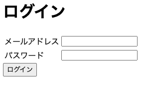

# クロスサイトスクリプティング（XSS）

---

# クロスサイトスクリプティング（XSS）とは？

* secure-coding-training `クロスサイトスクリプティング（XSS）` を参照
https://github.com/takapi86/secure-coding-training/blob/master/doc/README.pdf

* XSS再現からコードの修正まで
https://www.youtube.com/watch?v=qUcfaFQyw68

---

### 課題

このログイン画面にXSSの脆弱性が含まれています。
手元で再現させてみましょう。



---

### 環境の立ち上げ

```
git clone git@github.com:takapi86/secure-coding-training.git
cd secure-coding-training/app
docker-compose up
```

起動したブラウザで以下にアクセスし、ログイン画面が表示されたら成功です。

```
http://localhost:8888
```
