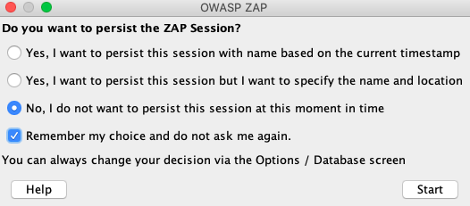
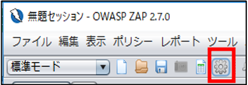
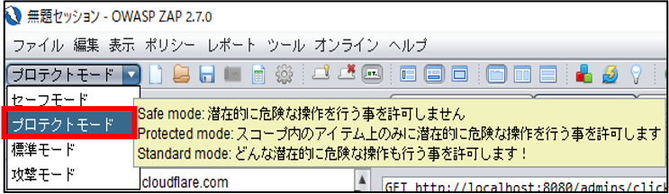
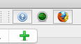
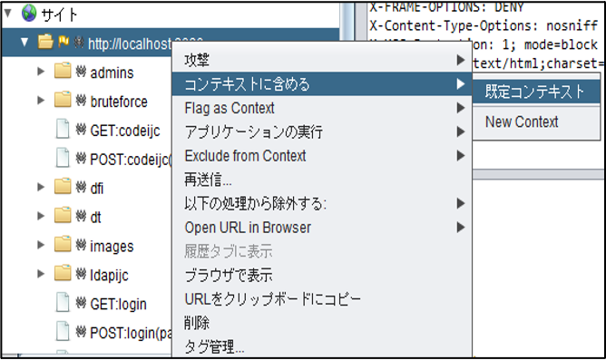
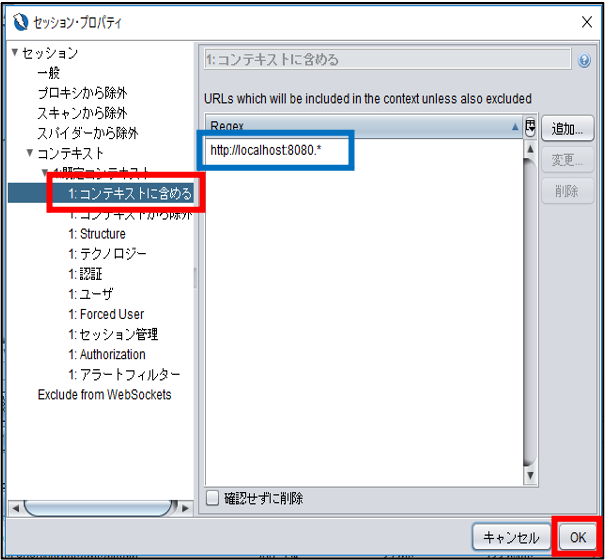
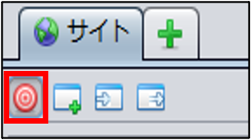

# 脆弱性診断

---

## 脆弱性の混入を防ぐには？

開発を行う中で、セキュリティチェックを行う必要がある。

---

* ソースコードレビュー
* ソースコード解析
  * Java・・・Jtest
  * Ruby・・・brakeman
* 手動診断
  * Owasp Zap, Burp Suite
* 自動診断
  * Owasp Zap, Burp Suite, AppScan, Vaddyなど
* ライブラリ脆弱性チェック（GitHubセキュリティアラート、Trivy）

---

# 自動診断を体験してみましょう

#### 使用するツール

OWASP ZAP

自動で実際の攻撃に近い検査用リクエストを送り脆弱性が含まれていないかスキャンすることができる。

---

## 1. OWASP ZAPを起動



※Manage Add-onsのポップアップが出てきたら今回は `Close` してください。

---

## 2. 各設定



上記のアイコンをクリック

* HUD
  * `Enable when using the ZAP Desktop` のチェックを外す
* Language
  * `日本語` を選択
  * OWASP ZAPを再起動

---

プロテクトモードを選択



---

## スキャン対象のWebアプリケーションの起動

画面右上のFireFoxのボタンをクリックします。



```
git clone git@github.com:takapi86/secure-coding-training.git
cd secure-coding-training/app
docker-compose up
```

起動したブラウザで以下にアクセスし、ログイン画面が表示されたら成功です。

```
http://localhost:8888
```

---



---



---



* `http://localhost:8888` へアクセスし適当な値でログイン
  * 失敗することを確認
* `http://localhost:8888` => `攻撃` => `動的スキャン` => `スキャンを開始`

---

## 結果を見てみましょう

* 1. `アラート` タブをクリックをクリックすると・・・？
* 2. 手動で再現させてみましょう
* 3. コードを直してみましょう
